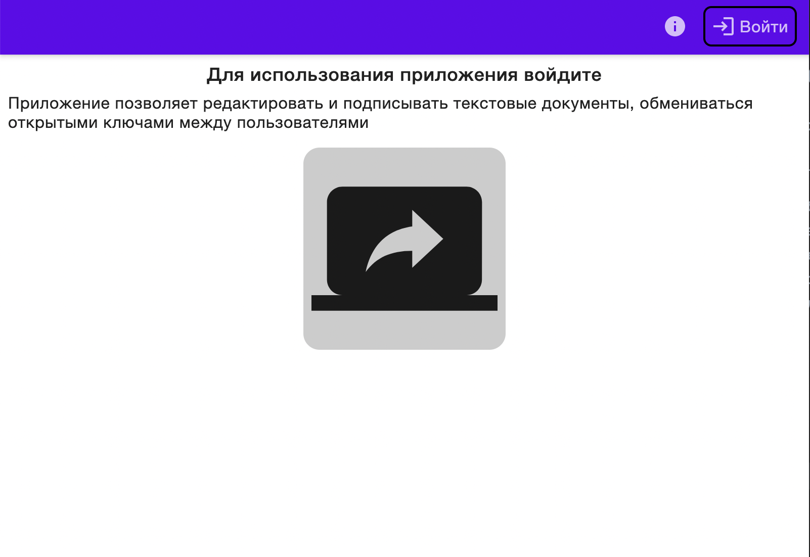
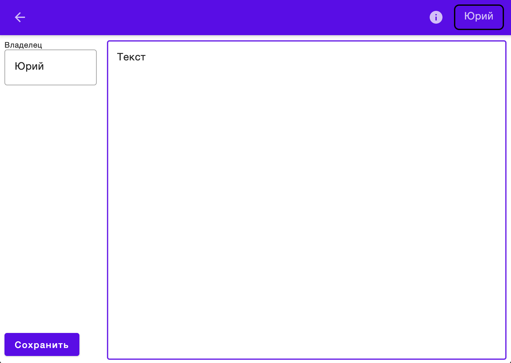

# FileSharing

Прототип системы электронного документооборота выполненый в рамках курса Криптографический методов защиты информации.

Функции:

* обмен между пользователями подписанными текстовыми документами
* редактирование текстовых документов
* сохранение и загрука текстовых документов вместе с электронной подписью

